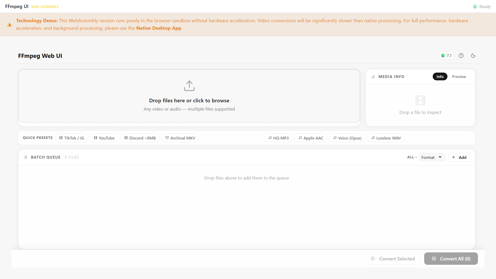
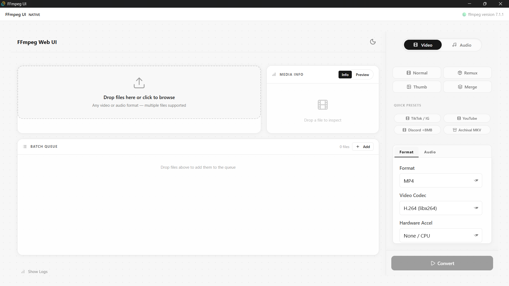

<p align="center">
  
  
</p>

<h1 align="center">FFmpeg UI</h1>

<p align="center">
  A beautifully designed, multi-platform frontend for FFmpeg.<br/>
  Convert, remux, trim, and process media — visually, without touching the terminal.
</p>

<p align="center">
  <a href="https://ffmpeg-ui.vercel.app"><strong>🌐 Live Web App</strong></a> ·
  <a href="https://github.com/bennypepper/FFmpeg-UI/releases/latest"><strong>⬇️ Download Desktop</strong></a> ·
  <a href="https://github.com/bennypepper/FFmpeg-UI"><strong>📦 Source Code</strong></a>
</p>

---

## What Is It?

FFmpeg UI is a **visual interface for FFmpeg** — the industry-standard open-source media processing engine. Instead of memorizing command flags and codec options, you get a clean, modern UI that builds and runs the commands for you.

The project targets **three distinct deployment environments**, each suited to a different use case, while sharing the same React component library and FFmpeg command-building logic under the hood.

---

## Platforms

### 🖥️ Desktop — Native App (Tauri)

> Installable `.msi` / `.dmg` / `.AppImage` application powered by [Tauri v2](https://v2.tauri.app) and Rust.

- Accesses your **native file system** directly — no uploads, no file size limits
- Bundles FFmpeg via **ffmpeg-sidecar** with auto-download if not installed
- Native **OS notifications** on job completion
- Persistent **settings** saved across sessions
- Hardware acceleration selector (NVENC, VAAPI, VideoToolbox, etc.)
- **Full batch queue** — process multiple files sequentially

📁 Source: [`apps/desktop/`](./apps/desktop/)  
⬇️ Download: [GitHub Releases](https://github.com/bennypepper/FFmpeg-UI/releases/latest)

---

### 🌐 WebAssembly — Browser App

> FFmpeg compiled to WASM, running **entirely inside your browser tab**. No server. No upload. Your files never leave your device.

- Works on any modern browser — Chrome, Firefox, Edge, Safari
- Powered by [`@ffmpeg/ffmpeg`](https://github.com/ffmpegwasm/ffmpeg.wasm) v0.12
- Requires a one-time ~30 MB download of the WASM core on first load (with visible progress)
- Enforces `Cross-Origin-Embedder-Policy: require-corp` for `SharedArrayBuffer` support
- Deployed to Vercel with the required isolation headers

📁 Source: [`apps/wasm-web/`](./apps/wasm-web/)  
🌐 Live: [ffmpeg-ui.vercel.app](https://ffmpeg-ui.vercel.app)

---

### 🐍 Local Server — Python Backend (Legacy)

> The original self-hosted version. A Python Flask server exposes an API that processes media server-side. Ideal for NAS boxes, home servers, or headless machines.

There are two sub-versions:

| Version | Path | Description |
|---|---|---|
| **Legacy** | [`apps/local-server/`](./apps/local-server/) | Standalone Python backend + plain HTML/CSS/JS frontend. No build step required. |
| **Modern Web UI** | [`apps/local-server-web/`](./apps/local-server-web/) | Same Python backend, but served with the unified React component library (`@ffmpeg-ui/ui`). |

**Prerequisites:** Python 3.8+, FFmpeg on system PATH.

```bash
# Windows
install_dependencies.bat
start_converter.bat

# macOS / Linux
./install_dependencies.sh
./start_converter.sh
```

---

## Features

| Feature | Desktop | WASM | Local Server |
|---|:---:|:---:|:---:|
| Video conversion | ✅ | ✅ | ✅ |
| Audio conversion | ✅ | ✅ | ✅ |
| Remux (no re-encode) | ✅ | ✅ | ✅ |
| Thumbnail extraction | ✅ | ✅ | ✅ |
| Merge / concatenate | ✅ | ✅ | ✅ |
| Batch queue | ✅ | ✅ | ✅ |
| Quick presets (TikTok, YouTube, Discord…) | ✅ | ✅ | ✅ |
| Media info + preview | ✅ | ✅ | ✅ |
| Hardware acceleration | ✅ | ❌ | Depends |
| Native file system access | ✅ | ❌ | ✅ |
| No internet required | ✅ | ❌¹ | ✅ |
| No installation needed | ❌ | ✅ | ❌ |
| Files stay on your device | ✅ | ✅ | ✅ |

> ¹ WASM requires an internet connection on first load to download the ~30 MB WASM core. After that, your browser may cache it.

---

## How It Works

```
┌─────────────────────────────────────────────────────────────┐
│                    packages/core                            │
│         TypeScript FFmpeg command builder                   │
│   buildFFmpegArgs({ mode, fmt, vc, crf, input, ... })      │
└───────────────────────┬─────────────────────────────────────┘
                        │ produces string[]
          ┌─────────────┼─────────────┐
          ▼             ▼             ▼
   Desktop (Tauri)   WASM (Browser)  Local Server
   Rust sidecar      ffmpeg.exec()   Python subprocess
   spawns FFmpeg     runs in WASM    runs FFmpeg
   natively          worker thread   server-side
          │             │             │
          └─────────────┼─────────────┘
                        │
                        ▼
               packages/ui
         Shared React components
         (MediaEditor, DropZone,
          BatchQueue, Terminal,
          SettingsPanel, Presets…)
```

The command logic lives in **`@ffmpeg-ui/core`** — a framework-agnostic TypeScript package. The UI lives in **`@ffmpeg-ui/ui`** — a React component library using CSS Modules with a glassmorphism-inspired design system. Every platform app (`desktop`, `wasm-web`, `local-server-web`) consumes both packages and handles its own backend bridge.

---

## Repository Structure

```
FFmpeg-UI/
├── apps/
│   ├── desktop/              # 🖥️  Tauri v2 + React 19 (native desktop)
│   │   └── src-tauri/        #     Rust backend — commands, sidecar, plugins
│   ├── wasm-web/             # 🌐  Vite + React 19 (WebAssembly browser app)
│   ├── local-server/         # 🐍  Legacy: Flask API + plain HTML/CSS/JS
│   └── local-server-web/     # 🐍  Modern: Flask API + React 19 UI
│
├── packages/
│   ├── core/                 # 📦  @ffmpeg-ui/core — FFmpeg command builders (TypeScript)
│   └── ui/                   # 🎨  @ffmpeg-ui/ui  — shared React components + CSS Modules
│
├── docs/
│   ├── ARCHITECTURE_PRD.md   # Engineering notes and migration plan
│   └── screenshots/          # UI screenshots
│
├── turbo.json                # Turborepo pipeline config
├── vercel.json               # COEP/COOP headers for Vercel deployment
└── package.json              # Workspace root (npm workspaces + Turborepo)
```

---

## Getting Started

### Prerequisites

| Tool | Version | Required for |
|---|---|---|
| Node.js | 18+ | All apps |
| npm | 9+ | All apps |
| Rust + Cargo | stable | Desktop only |
| Python | 3.8+ | Local Server only |
| FFmpeg | any | Local Server only |

> **Desktop (Tauri) prerequisites:** Follow the [Tauri v2 setup guide](https://v2.tauri.app/start/prerequisites/) for your OS. On Windows this means the Visual Studio C++ Build Tools and WebView2.

---

### 1. Clone

```bash
git clone https://github.com/bennypepper/FFmpeg-UI.git
cd FFmpeg-UI
```

### 2. Install All Dependencies

```bash
npm install
```

This installs dependencies for all workspace packages (`apps/*` and `packages/*`) in a single command via npm workspaces.

---

### Running the WebAssembly App (Easiest)

```bash
# Development server with COEP headers
cd apps/wasm-web
npm run dev
```

Open `http://localhost:5173`. The WASM core (~30 MB) will download on first load — watch the progress bar in the app. Once the titlebar shows **🟢 Ready**, you can start converting files.

> ⚠️ The WASM core requires cross-origin isolation headers. The dev server in `vite.config.ts` already sets them. For production, `vercel.json` handles it.

---

### Running the Desktop App

```bash
cd apps/desktop
npm run tauri dev
```

On first launch on a machine without FFmpeg installed, the app will show a warning overlay and offer to automatically download the required binaries. The download is ~80 MB.

**Building an installer:**

```bash
npm run tauri build
```

Output is in `apps/desktop/src-tauri/target/release/bundle/`.

---

### Running the Local Server (Legacy)

```bash
cd apps/local-server

# Windows
install_dependencies.bat   # installs Python deps
start_converter.bat        # starts Flask on http://localhost:5000

# macOS / Linux
./install_dependencies.sh
./start_converter.sh
```

---

### Running Everything (Monorepo Dev Mode)

```bash
# From repo root — starts all apps in parallel via Turborepo
npm run dev
```

> Note: Running `npm run dev` from the root will attempt to start all apps including the Tauri desktop app, which requires Rust toolchain to be installed.

---

## Tech Stack

### Desktop
- [Tauri v2](https://v2.tauri.app) — Rust-based native app shell
- [React 19](https://react.dev) + TypeScript
- [ffmpeg-sidecar](https://crates.io/crates/ffmpeg-sidecar) — FFmpeg binary management in Rust
- `tauri-plugin-store`, `tauri-plugin-notification`, `tauri-plugin-dialog`

### WebAssembly
- [Vite 8](https://vite.dev) + React 19 + TypeScript
- [`@ffmpeg/ffmpeg`](https://github.com/ffmpegwasm/ffmpeg.wasm) v0.12 — FFmpeg compiled to WASM
- [`@ffmpeg/util`](https://github.com/ffmpegwasm/ffmpeg.wasm) — `toBlobURL`, `fetchFile` helpers

### Shared Packages
- **`@ffmpeg-ui/core`** — Pure TypeScript. No runtime dependencies. Builds FFmpeg argument arrays from structured options objects.
- **`@ffmpeg-ui/ui`** — React 19 + CSS Modules. Zero external CSS frameworks. Premium glassmorphism design system with dark/light mode.

### Monorepo Tooling
- [Turborepo](https://turbo.build) — parallel task runner with caching
- npm workspaces — dependency hoisting and cross-package linking

---

## Design System

The UI is built on a bespoke CSS variable system — no Tailwind, no external component libraries. Key principles:

- **Glassmorphism** — `backdrop-filter: blur()`, translucent panels
- **Monochromatic palette** — light and dark modes via `[data-theme="dark"]` attribute
- **CSS Modules** — scoped styles, zero class name collisions across packages
- **Micro-animations** — hover states, progress bars, spinners all in vanilla CSS

---

## License

MIT © [bennypepper](https://github.com/bennypepper)

---

## Contributing

Pull requests are welcome. For major changes, please open an issue first.  
The architecture is documented in [`docs/ARCHITECTURE_PRD.md`](./docs/ARCHITECTURE_PRD.md).
